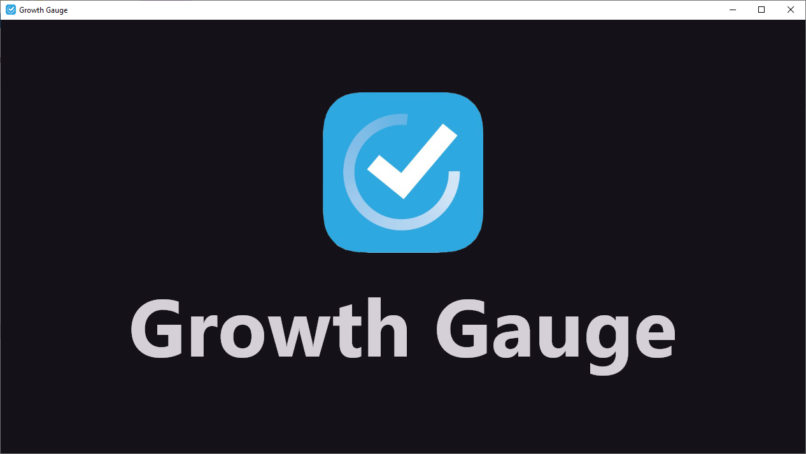
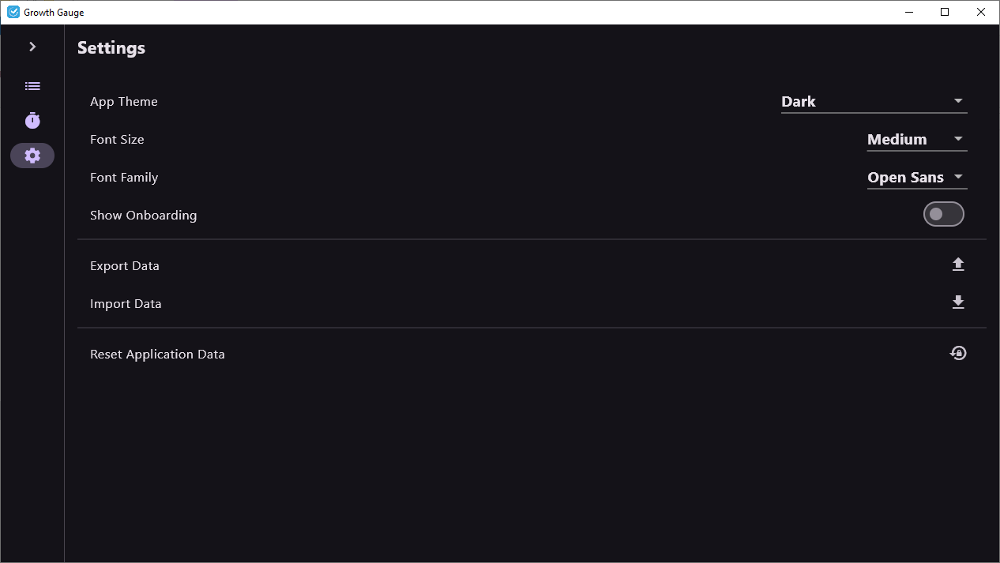
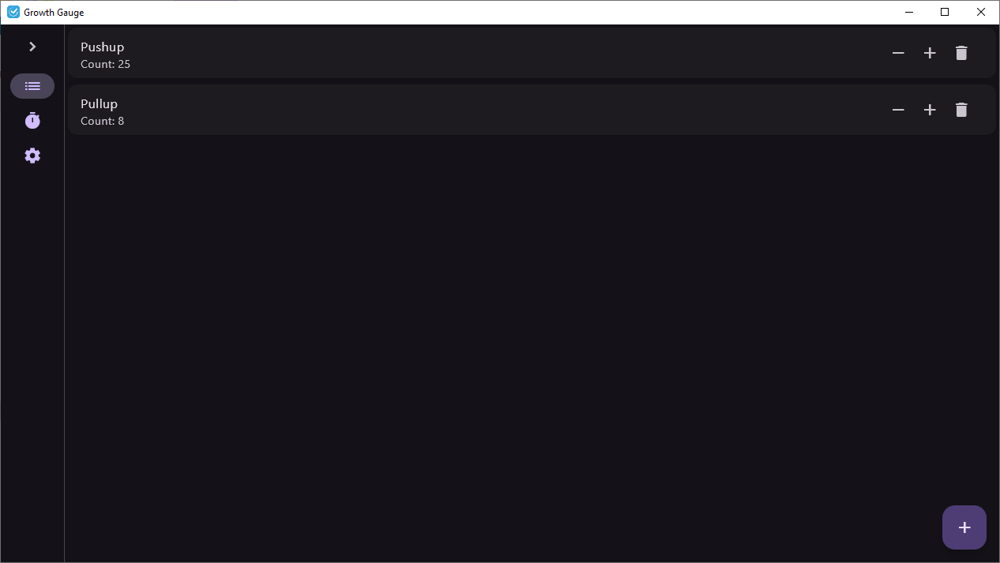
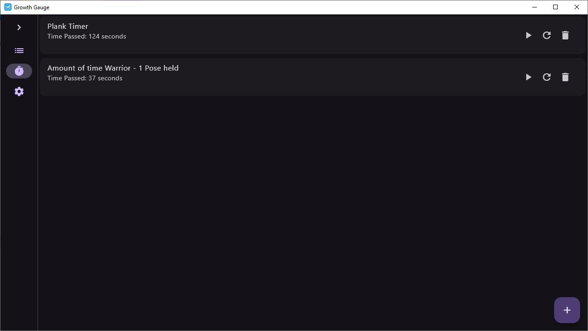
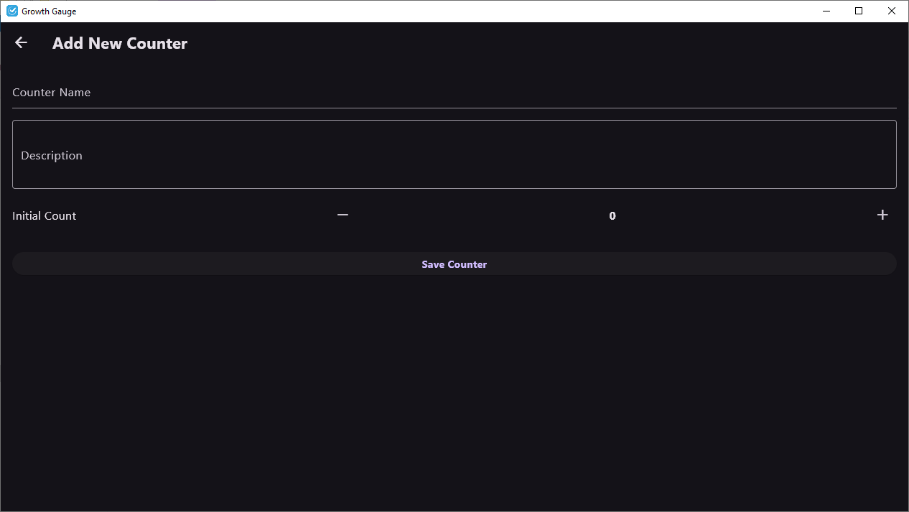
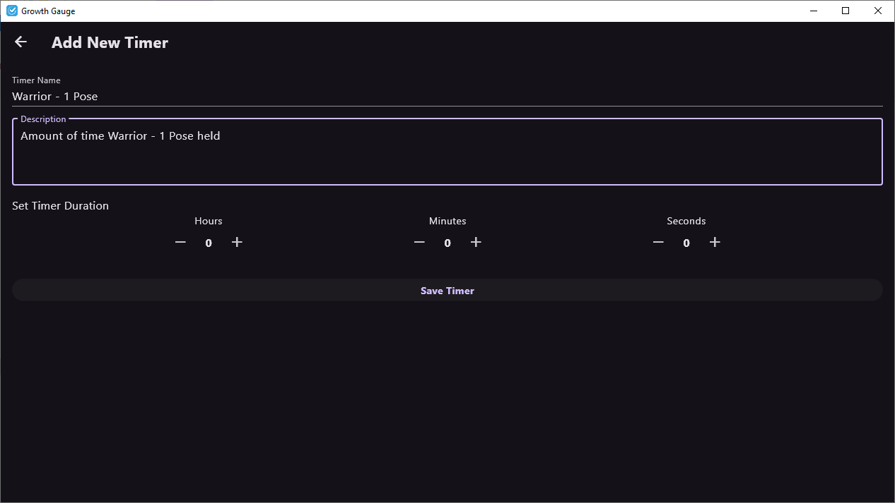
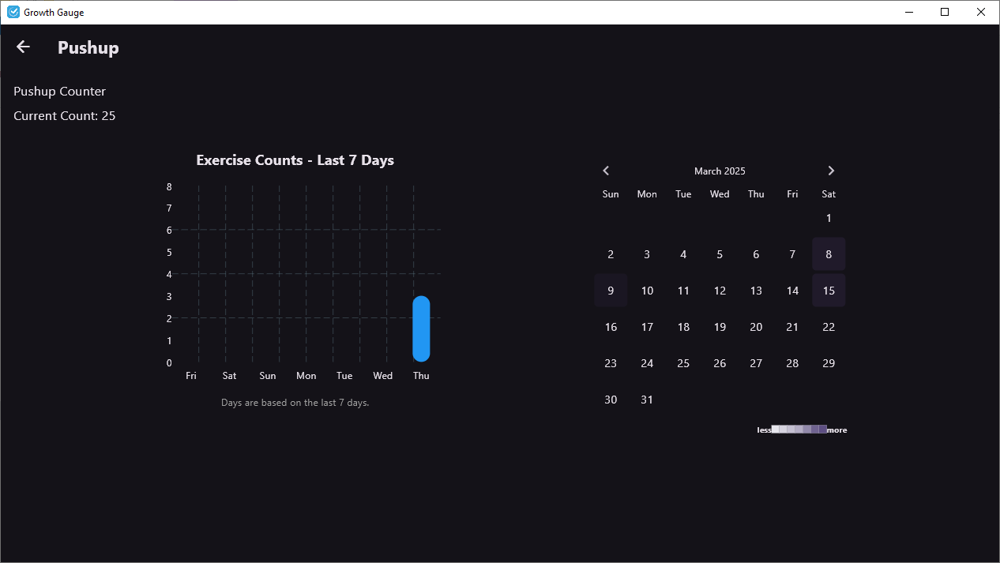
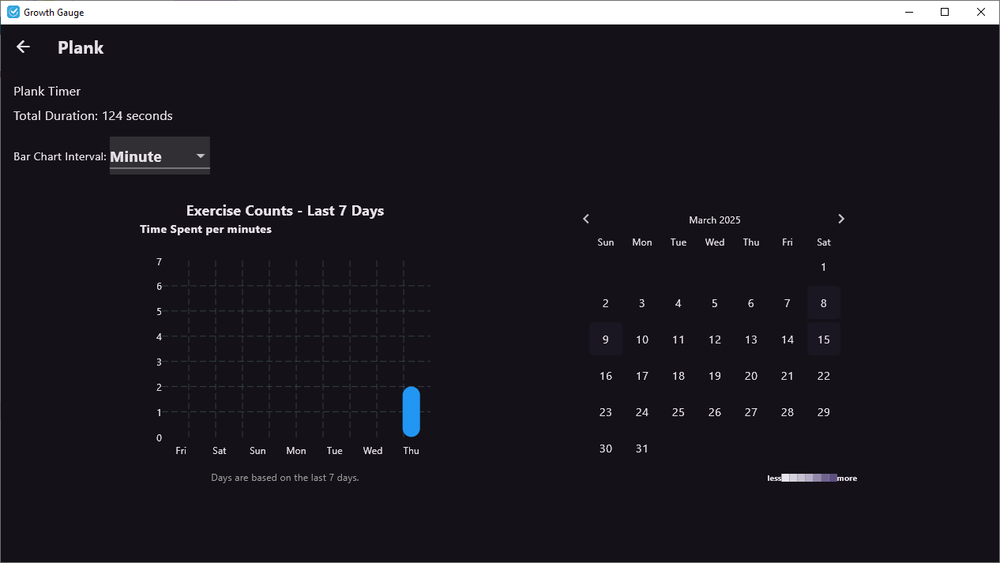

# Growth Gauge

[](https://dart.dev/null-safety)
[](https://github.com/0Vipin0/growth_gauge/releases)
[](https://github.com/0Vipin0/growth_gauge/network)
[](https://github.com/0Vipin0/growth_gauge/commits/main)
[](https://github.com/0Vipin0/growth_gauge/pulls)
[](https://github.com/0Vipin0/growth_gauge)
[](https://github.com/0Vipin0/growth_gauge/blob/main/LICENSE)
[](https://pub.dev/packages/lint)


## Description

Growth Gauge is your personal companion for tracking tasks and time-based activities.  This application goes beyond simple counting, visualizing your progress with insightful graphs and statistics to help you understand your activity patterns and achievements.

## Features

*   **Organized Counter Lists:**  Effortlessly manage and track all your ongoing tasks and timers within a clear and intuitive list.
*   **Detailed Counter Insights:** Dive deep into each counter with comprehensive detail views, including:
    *   **Heatmaps:**  Visually identify trends and peak activity periods over extended durations.
    *   **7-Day Charts:**  Quickly review your performance and counts for the past week at a glance.
*   **JSON and CSV Data Export:**  Securely export your valuable counter and timer data as JSON files for backup, sharing, or in CSV file for in-depth analysis with other tools.
*   **Persistent Data Storage:**  Enjoy peace of mind knowing your data is persistently stored using Shared Preferences, ensuring your progress is saved across all application sessions.
*   **Personalized App Experience:** Customize the look and feel of Growth Gauge to match your style by adjusting application themes and fonts directly within the settings.
*   **Local Authentication:** To protect your own private data from prying eyes of the other, local authentincation using Biometric with Pin Authentication as fallback ensure that the data is always yours to see.
*   **Scheduled Local Notification:** To keep you motivated to conitnuing the growth, scheduled local notifications are included allowing you to remember the idea of growth everyday.
*   **Automatic Build Release:** New version release files are generated with Github Action and available under releases.

## Screenshots

| Feature           | Screenshot                      | Feature           | Screenshot                      |
| :---------------- | :------------------------------ | :---------------- | :------------------------------ |
| Startup Screen    |        | Settings          |      |
| Counter List      |  | Timer List        |    |
| Add Counter       |   | Add Timer         |     |
| Counter Details   |  | Timer Details     |  |

## Build Process
1.  **Flutter Environment Setup:** Refer to the official Flutter installation guide for detailed platform-specific instructions: [Flutter Install Guide](https://flutter.dev/docs/get-started/install).

2.  **Dependency Retrieval:**
    ```bash
    flutter pub get
    ```

3.  **Code Analysis :**
    ```bash
    flutter analyze
    ```

4.  **Platform-Specific Builds:** Build the application for your desired target platform using Flutter's build commands. Common examples include:
    *   **Android (APK):** `flutter build apk` (For distribution, consider `flutter build apk --split-per-abi`)
    *   **Android (App Bundle - recommended for Play Store):** `flutter build appbundle`
    *   **iOS:** `flutter build ios` (Requires macOS and Xcode)
    *   **Web:** `flutter build web`
    *   **Windows:** `flutter build windows`
    *   **Linux:** `flutter build linux`
    *   **Macos:** `flutter build macos`

5.  **Run for Development:** To quickly run the application on a connected device or emulator during development, use:
    ```bash
    flutter run
    ```
    
## Latest Releases
*  [Android][android]
*  [Linux][linux]
*  [Windows][windows]

[android]: https://github.com/0Vipin0/growth_gauge/releases/download/v1.1.2/growth_gauge_android-v1.1.2.apk
[linux]: https://github.com/0Vipin0/growth_gauge/releases/download/v1.1.2/growth_gauge_linux-v1.1.2.zip
[windows]: https://github.com/0Vipin0/growth_gauge/releases/download/v1.1.2/growth_gauge_windows-v1.1.2.zip

Kindly note that the releases are primarily based on the Android and Windows platform as these are ones that I am building. I do not own MacOs/iOS operating system, so I am not testing the same and they are not priortized as of now. If someone finds any issue, kindly raise an Issue for the same.

## Future Goals and Roadmap

*   ~**Automated Builds with GitHub Actions** ([#13][i13])~
*   ~**CSV Data Export** ([#14][i14])~
*   **Cross-Device Data Synchronization** ([#15][i15])
*   ~**Local User Authentication** ([#16][i16])~
*   ~**Sound Alerts and Notifications** ([#17][i17])~
*   ~**Target Tracking** ([#18][i18])~
*   ~**Data Categorization** ([#19][i19])~
*   **Summary Statistics** ([#20][i20])

[i13]: https://github.com/0Vipin0/growth_gauge/issues/13
[i14]: https://github.com/0Vipin0/growth_gauge/issues/14
[i15]: https://github.com/0Vipin0/growth_gauge/issues/15
[i16]: https://github.com/0Vipin0/growth_gauge/issues/16
[i17]: https://github.com/0Vipin0/growth_gauge/issues/17
[i18]: https://github.com/0Vipin0/growth_gauge/issues/18
[i19]: https://github.com/0Vipin0/growth_gauge/issues/19
[i20]: https://github.com/0Vipin0/growth_gauge/issues/20

## License

Growth Gauge is licensed under the [BSD 3-Clause License](LICENSE).  See the `LICENSE` file for the full license text.
