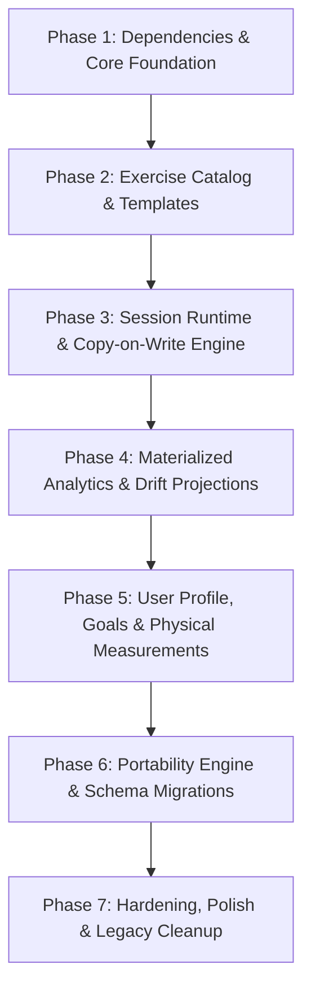

# Growth Gauge: Modular Implementation Plan

## 1. Executive Summary & Tech Stack Decisions

Based on the canonical architecture specifications in [`design/Application_Architecture.md`](Application_Architecture.md) and reference fixtures in [`design/Persona_Worked_Example.json`](
Persona_Worked_Example.json), the application will undergo a clean, structured pivot into a dedicated, offline-first strength and conditioning fitness tracker.

### Core Architectural Decisions
- **Scope & Migration:** Completely replace legacy counter/timer features with the new fitness domain architecture.
- **Persistence Engine:** **Drift (SQLite)** powers:
  1. **Authoritative Document Store:** Hierarchical JSON aggregate documents stored in a `documents` table with composite primary keys (`collection`, `id`) and timestamps.
  2. **Materialized Relational Read Models:** Normalized SQLite tables for instant, zero-lag charting, analytics queries, and personal records.
- **State Management:** **flutter_bloc / cubit** combined with Clean Architecture (Commands/Queries/Use Cases), providing deterministic state machine transitions for active workout sessions.
- **Data Models:** **Freezed + json_serializable** for immutable domain entities, value objects, domain events, and audit logs.
- **Visualizations:** **fl_chart** integrated with reactive Drift query streams.

---

## 2. Target Directory & Module Structure

```text
lib/
├── core/
│   ├── database/                # Drift AppDatabase, document tables, relational read tables
│   ├── error/                   # Failures & Result monad
│   ├── events/                  # DomainEvent bus / in-memory event dispatcher
│   ├── ids/                     # UniqueId value object & UUIDv4 validation
│   ├── time/                    # Clock abstraction & UTC date-time utilities
│   └── units/                   # Canonical unit converters (kg <-> lb, cm <-> in)
│
├── features/
│   ├── user/                    # User account, profile, training profile, goals, equipment, measurements
│   │   ├── domain/              # Entities & Value Objects (Freezed)
│   │   ├── application/         # UserCubit, GoalCubit, MeasurementCubit / UseCases
│   │   ├── infrastructure/      # Drift-backed User Document Repository
│   │   └── presentation/        # Profile, Goals, Equipment, and Settings screens
│   │
│   ├── catalog/                 # Exercise catalog, taxonomy, measurement profiles, relationships
│   │   ├── domain/              # Exercise, MovementPattern, MuscleGroup, MeasurementProfile
│   │   ├── application/         # ExerciseBloc / CatalogUseCases
│   │   ├── infrastructure/      # Exercise Repository & Seed Data Loader
│   │   └── presentation/        # Catalog browser, filter sheet, exercise detail
│   │
│   ├── template/                # Routines, workout blocks, immutable template revisions
│   │   ├── domain/              # WorkoutTemplate, TemplateRevision, WorkoutBlock, TargetSet
│   │   ├── application/         # TemplateBloc / TemplateUseCases
│   │   ├── infrastructure/      # Template Repository
│   │   └── presentation/        # Routine list, template editor, block builder
│   │
│   ├── session/                 # Live workout runtime, copy-on-write execution, rest timers, recovery
│   │   ├── domain/              # WorkoutSession, ExecutionSet, RestInterval, Interruption, AuditEntry
│   │   ├── application/         # WorkoutSessionBloc (State Machine: Draft, InProgress, Paused, Completed)
│   │   ├── infrastructure/      # Session Document Repository & Crash Recovery Cache
│   │   └── presentation/        # Active HUD, set logger, rest overlay, summary dialog
│   │
│   ├── analytics/               # Materialized read models, projections, PRs, visualizations
│   │   ├── domain/              # Read models: DailySummary, ExerciseMetrics, PersonalRecord
│   │   ├── projection/          # AnalyticsProjector (SessionCompletedEvent -> Drift tables)
│   │   ├── application/         # AnalyticsCubit / Query Handlers / RebuildAnalyticsUseCase
│   │   └── presentation/        # History list, PR trophy shelf, volume/frequency charts
│   │
│   └── portability/             # Versioned import/export, schema migrations, conflict resolution
│       ├── domain/              # ExportEnvelope, Manifest, ConflictStrategy, ImportReport
│       ├── application/         # ExportDataUseCase, ImportDataUseCase, MigrationPipeline
│       ├── infrastructure/      # Portability repository & SHA-256 validator
│       └── presentation/        # Backup/Restore UI & Conflict Resolution modal
│
└── app/                         # App entrypoint, routing, global theme, DI setup
```

---

## 3. Implementation Roadmap Overview



### Phase Progress Tracker

| Phase | Description | Status | Completed Steps | Total Steps |
|---|---|---|---|---|
| **Phase 1** | Dependencies & Core Foundation | `[x] COMPLETED` | 6 | 6 |
| **Phase 2** | Exercise Catalog & Templates | `[x] COMPLETED` | 7 | 7 |
| **Phase 3** | Session Runtime & Copy-on-Write Engine | `[*] IN PROGRESS` | 2 | 8 |
| **Phase 4** | Materialized Analytics & Drift Projections | `[ ] NOT STARTED` | 0 | 7 |
| **Phase 5** | User Profile, Goals & Physical Measurements | `[ ] NOT STARTED` | 0 | 4 |
| **Phase 6** | Portability Engine, Export/Import & Migrations | `[ ] NOT STARTED` | 0 | 5 |
| **Phase 7** | Hardening, Polish & Legacy Cleanup | `[ ] NOT STARTED` | 0 | 4 |

---

## 4. Phase 1: Comprehensive Details (Dependencies & Core Foundation)

Phase 1 establishes the bedrock for the entire architecture: type-safe core primitives, domain event bus, and the authoritative Drift document store.

### 4.1 Dependency Configuration (`pubspec.yaml`)
```yaml
dependencies:
  # State Management
  flutter_bloc: ^9.0.0
  bloc: ^9.0.0
  equatable: ^2.0.7

  # Persistence Engine (Authoritative Store & Materialized Read Models)
  drift: ^2.24.2
  sqlite3_flutter_libs: ^0.5.28
  drift_flutter: ^0.2.4
  path: ^1.9.1

dev_dependencies:
  # Drift Code Generation
  drift_dev: ^2.24.2
```

### 4.2 Phase 1 File Manifest
- `lib/core/ids/unique_id.dart`: Value object wrapping UUIDv4 with validation and equality.
- `lib/core/time/app_clock.dart`: Deterministic clock abstraction producing ISO-8601 UTC strings.
- `lib/core/error/failures.dart`: `Failure`, `DatabaseFailure`, `NotFoundFailure`, `ValidationFailure`, `ConflictFailure`.
- `lib/core/error/result.dart`: Functional sealed monad `Result<T, Failure>` with `Success` and `Error`.
- `lib/core/units/unit_types.dart`: `WeightUnit`, `DistanceUnit`, `HeightUnit`, `TemperatureUnit`.
- `lib/core/units/unit_converter.dart`: Bidirectional conversions between canonical units (kg, m, cm, °C) and display units.
- `lib/core/events/domain_event.dart`: Base `DomainEvent` with `eventId`, `occurredAt`, `aggregateId`, and `eventType`.
- `lib/core/events/domain_event_dispatcher.dart`: In-memory broadcast stream dispatcher with typed subscriptions.
- `lib/core/database/tables/documents_table.dart`: Drift `documents` table definition with composite primary key `(collection, id)`.
- `lib/core/database/app_database.dart`: Main Drift database class with in-memory factory constructor.
- `lib/core/database/document_adapter.dart`: `DocumentAdapter<T>` contract for JSON serialization.
- `lib/core/database/document_store.dart`: Generic `IDocumentStore<T>` interface.
- `lib/core/database/drift_document_store.dart`: Drift-backed implementation of `IDocumentStore<T>`.
- `lib/core/database/app_database.g.dart`: Generated Drift database code.

### 4.3 Phase 1 Execution Log & Step Status

| Step | Action | Status | Notes |
|---|---|---|---|
| **Step 1.1** | Configure Dependencies | `[x] COMPLETED` | Added `drift: ^2.31.0`, `drift_flutter: ^0.2.8`, `drift_dev: ^2.31.0`, `sqlite3_flutter_libs: ^0.5.42`, `flutter_bloc: ^9.1.1`, `bloc: ^9.2.1`, `equatable: ^2.0.7`, `path: ^1.9.1`. Resolved with `freezed: ^3.2.5`. |
| **Step 1.2** | Core Primitives | `[x] COMPLETED` | Implemented `UniqueId`, `AppClock`, `Failure` hierarchy, `Result<T, Failure>` monad, and `UnitConverter`. |
| **Step 1.3** | Domain Event Dispatcher | `[x] COMPLETED` | Implemented `DomainEvent` and `DomainEventDispatcher` with asynchronous typed subscription handling. |
| **Step 1.4** | Drift Document Store | `[x] COMPLETED` | Defined `Documents` table, `AppDatabase`, `DocumentAdapter<T>`, `IDocumentStore<T>`, and `DriftDocumentStore<T>`. |
| **Step 1.5** | Code Generation | `[x] COMPLETED` | Generated `lib/core/database/app_database.g.dart` via `build_runner`. |
| **Step 1.6** | Test Verification Suite | `[x] COMPLETED` | Implemented 6 test suites across `test/core/`. **27/27 test cases passed (100% success rate)**. |

### 4.4 Phase 1 Test Verification Results

All 27 test cases passed with zero failures in `test/core/`:
- **`test/core/database/drift_document_store_test.dart` (7 tests)**:
  - `upsert and getById retrieve stored entity accurately` (PASSED)
  - `getById returns NotFoundFailure when entity does not exist` (PASSED)
  - `second upsert with same ID updates entity in-place without duplicating rows` (PASSED)
  - `getAll returns all entities in the collection` (PASSED)
  - `delete removes entity from document store` (PASSED)
  - `watchAll emits reactive updates when documents are added` (PASSED)
  - `clearCollection deletes all entities in collection` (PASSED)
- **`test/core/events/domain_event_dispatcher_test.dart` (2 tests)**:
  - `dispatches events to typed subscribers` (PASSED)
  - `cancelled subscription does not receive subsequent events` (PASSED)
- **`test/core/ids/unique_id_test.dart` (4 tests)**:
  - `generate() creates a valid UUIDv4` (PASSED)
  - `from() preserves valid custom IDs` (PASSED)
  - `from() throws ArgumentError for empty or whitespace-only strings` (PASSED)
  - `equality holds for matching values` (PASSED)
- **`test/core/time/app_clock_test.dart` (4 tests)**:
  - `nowUtc() always produces DateTime with isUtc true` (PASSED)
  - `nowIsoUtc() produces ISO-8601 UTC timestamp` (PASSED)
  - `deterministic clock testing using withClock` (PASSED)
  - `parseIsoUtc and formatIsoUtc roundtrip` (PASSED)
- **`test/core/units/unit_converter_test.dart` (6 tests)**:
  - `weight conversions roundtrip with minimal floating-point deviation` (PASSED)
  - `weightToCanonical and weightFromCanonical obey unit selection` (PASSED)
  - `formatWeight produces clean human-readable output` (PASSED)
  - `distance conversions roundtrip correctly` (PASSED)
  - `height conversions (cm to feet/inches) roundtrip accurately` (PASSED)
  - `temperature conversions` (PASSED)
- **`test/core/error/result_test.dart` (4 tests)**:
  - `Success holds data and returns true for isSuccess` (PASSED)
  - `Error holds failure and returns true for isError` (PASSED)
  - `flatMap chains operations correctly` (PASSED)
  - `Failures equality and toString behavior` (PASSED)

---

## 5. Phase 2: Comprehensive Details (Exercise Catalog & Workout Templates)

Phase 2 builds the reusable program definitions: the **Exercise Catalog** and **Workout Templates with Immutable Revisions**.

### 5.1 Key Architecture & Domain Rules
1. **Taxonomy & Classification:** Exercises support multi-dimensional classification (Body Region, Movement Pattern, Muscle Group, Equipment, Measurement Profile) and relationship links (alternatives, regressions, progressions).
2. **Immutable Template Revisions:** Published revisions are frozen and strictly immutable. Editing a template creates a new revision with `revisionNumber = current + 1` in `DRAFT` status.
3. **Standard Seed Fixtures:** Standard system exercises are auto-seeded on initial app launch if the catalog is empty.

### 5.2 Phase 2 File Manifest
- `lib/features/catalog/domain/`: `exercise.dart`, `exercise_enums.dart`, `exercise_classification.dart`, `exercise_execution.dart`, `exercise_equipment.dart`, `exercise_relationship.dart`, `measurement_profile.dart`.
- `lib/features/catalog/application/`: `catalog_use_cases.dart`, `catalog_cubit.dart`.
- `lib/features/catalog/infrastructure/`: `exercise_document_adapter.dart`, `exercise_repository.dart`, `seed/exercise_seed_data.dart`, `catalog_seeder.dart`.
- `lib/features/catalog/presentation/`: `catalog_screen.dart`, `exercise_detail_screen.dart`, `custom_exercise_screen.dart`.
- `lib/features/template/domain/`: `workout_template.dart`, `workout_template_revision.dart`, `workout_block.dart`, `template_item.dart`, `target_set.dart`, `rest_policy.dart`, `template_enums.dart`.
- `lib/features/template/application/`: `template_use_cases.dart`.
- `lib/features/template/infrastructure/`: `template_document_adapters.dart`, `template_repository.dart`.
- `lib/features/template/presentation/`: `template_list_screen.dart`, `template_detail_screen.dart`, `template_editor_screen.dart`.
- Tests under `test/features/catalog/` and `test/features/template/`.

### 5.3 Phase 2 Execution Status

| Step | Action | Status | Notes |
|---|---|---|---|
| **Step 2.1** | Catalog domain and document persistence | `[x] COMPLETED` | Exercise taxonomy, JSON adapter, and Drift-backed repository are present. Seed fixture constructor fields were aligned with the current model. |
| **Step 2.2** | Catalog seeding and use cases | `[x] COMPLETED` | Added empty-catalog seeding, catalog filters, custom exercise creation, and guarded archive behavior for system exercises. |
| **Step 2.3** | Template document persistence | `[x] COMPLETED` | Added separate document adapters and repository for stable templates and immutable revision snapshots. |
| **Step 2.4** | Draft and publish lifecycle | `[x] COMPLETED` | Added template creation, draft-from-current, draft updates, and publication; repository rejects edits to already-published revisions. |
| **Step 2.5** | Catalog presentation | `[x] COMPLETED` | Search and taxonomy filters cover body region, movement pattern, muscle group, and equipment. Custom exercise creation captures classification and metric data; owners can add/remove exercise relationships. |
| **Step 2.6** | Template presentation | `[x] COMPLETED` | Template list/detail/editor support immutable draft revisions, block types and rounds, ordering, exercise selection, and per-set rep, weight, duration, distance, calorie, and rest targets. |
| **Step 2.7** | Phase 2 integration and acceptance checks | `[x] COMPLETED` | Catalog auto-seeds on app startup and catalog/templates are reachable from Training navigation. All 13 catalog/template tests pass; scoped Flutter analysis reports no issues. |

---

## 6. Phase 3: Comprehensive Details (Active Session Runtime & Copy-on-Write Engine)

Phase 3 implements the live workout tracking engine: copy-on-write execution, deterministic state machines, rest/recovery timers, append-only audits, and crash recovery.

### 6.1 Key Architecture & Domain Rules
1. **Copy-on-Write Runtime Isolation:** A template revision is cloned into an independent `WorkoutSession` aggregate. Live session adjustments never mutate the template revision.
2. **State Machine:** `DRAFT` -> `STARTING` -> `IN_PROGRESS` <-> `PAUSED` -> `COMPLETING` -> `COMPLETED`.
3. **Interruption Tracking:** Wall-clock duration is distinguished from active training duration:
   $$\text{elapsedActiveSeconds} = \text{elapsedWallClockSeconds} - \sum \text{interruptionDurationSeconds}$$
4. **Append-Only Audit Log:** Every set edit or deletion appends an immutable `AuditEntry`.
5. **Crash Recovery:** Every set logged writes through to Drift; cold boot auto-detects uncompleted sessions and prompts recovery.

### 6.2 Phase 3 File Manifest
- `lib/features/session/domain/`: `workout_session.dart`, `session_block.dart`, `session_item.dart`, `execution_set.dart`, `rest_interval.dart`, `session_interruption.dart`, `audit_entry.dart`, `session_enums.dart`, `session_events.dart`.
- `lib/features/session/application/`: `session_use_cases.dart`, `workout_session_bloc.dart`.
- `lib/features/session/infrastructure/`: `session_document_adapter.dart`, `session_repository.dart`, `crash_recovery_service.dart`.
- `lib/features/session/presentation/`: `active_session_screen.dart`, `session_summary_screen.dart`, `active_exercise_card.dart`, `execution_set_row.dart`, `rest_timer_overlay.dart`, `plate_calculator_sheet.dart`, `session_recovery_dialog.dart`.
- Tests under `test/features/session/` verifying copy-on-write, state transitions, audit trail, and crash recovery.

### 6.3 Phase 3 Execution Status

| Step | Action | Status | Notes |
|---|---|---|---|
| **Step 3.1** | Session runtime domain snapshots and serialization | `[x] COMPLETED` | Added immutable session, block, item, execution set, rest interval, interruption, audit, and lifecycle enum models with JSON serialization. |
| **Step 3.2** | Copy-on-write from a template revision | `[x] COMPLETED` | `SessionUseCases.createFromRevision` snapshots template content into session-owned IDs, retains source IDs, and allows active-session target edits without changing the template. |
| **Step 3.3** | Persisted lifecycle state machine | `[*] IN PROGRESS` | Start, pause, resume, complete, cancel, abandon, app-background interruption, and interrupted `STARTING`/`COMPLETING` recovery persist; transition verification remains. |
| **Step 3.4** | Execution set logging and rest interval runtime | `[*] IN PROGRESS` | Full supported measurements, target edits, validation, skip/delete, policy-driven rest auto-start/expiry, minimum skip duration, and bounded extensions are implemented; behavior verification remains. |
| **Step 3.5** | Append-only audits and domain events | `[*] IN PROGRESS` | Set updates/deletion and lifecycle actions append audit entries; deleting a set also archives linked rest history in audit. Lifecycle, rest completion/skip, and set completion/skip/delete events publish after persistence. Event verification remains. |
| **Step 3.6** | Session document repository and crash recovery query | `[*] IN PROGRESS` | Home cold-start and template flows offer recovery, unfinished-session lookup excludes drafts, interrupted transitions are repaired, and active sessions persist a pause on app background; authenticated user context and verification remain. |
| **Step 3.7** | Active session and recovery presentation | `[*] IN PROGRESS` | Active UI uses `WorkoutSessionBloc` to serialize command state, captures supported measurements, resolves exercise names, offers session target edits, deletion of planned and logged sets, cancel/abandon, and auto-expiring rest controls. Summary reports elapsed, active, and rest time. Remaining presentation polish remains. |
| **Step 3.8** | Session integration and acceptance checks | `[ ] NOT STARTED` | Add session tests, verify cross-feature behavior, and run the complete acceptance checks. |

### 6.4 Phase 3 Work Started (2026-09-26)

Implemented the session domain and persistence foundation under `lib/features/session/`, including snapshot models, published-template revision cloning, session-only target editing, lifecycle and set-recording use cases, append-only audit entries, domain events, and a Drift-backed repository. Session writes now use the document store's current update timestamp instead of deriving `updatedAt` from the original start/pause time, keeping active-session ordering current for recovery and listing. Added set validation/skip/delete and policy-aware rest operations: auto-start after set logging, automatic expiry, minimum skip time, optional skip/extend, maximum-duration enforcement, and audit/event records. Deleting a set with completed rest history appends rest deletion audits; an active rest must finish first. Active rests close when a session pauses or ends. Backgrounding the active screen now persists an application interruption and pauses active time. Cancel and abandon preserve session history and publish lifecycle events. Recovery excludes unstarted drafts, resumes interrupted starts, and finalizes sessions interrupted during completion. Home and template flows offer recovery; the active screen uses `WorkoutSessionBloc` to serialize command state, supports all modeled measurements and target editing, and allows deleting logged sets while retaining their audit history. The summary reports wall-clock, active, and rest duration. Scoped static analysis passes with no issues. Session tests, authenticated user context, and remaining lifecycle/event verification are not complete, so Phase 3 remains in progress.

---

## 7. Phase 4: Comprehensive Details (Materialized Analytics & Drift Projections)

Phase 4 implements the high-performance analytics query engine, projection pipeline, and visual dashboards.

### 7.1 Architecture & Domain Rules

```text
Completed WorkoutSession
          │
          ▼
WorkoutSessionCompletedEvent
          │
          ▼
AnalyticsProjector (Transactional)
          ├── 1. Daily Summary Record
          ├── 2. Exercise Set Metrics
          ├── 3. Personal Record Evaluation
          ├── 4. Muscle Volume Aggregates
          └── 5. Rest Interval Adherence
          │
          ▼
Drift Materialized Tables (SQLite)
          │
          ▼
fl_chart Reactive Streams
```

1. **Materialized Read Models vs. Source of Truth (Section 2.1 & Rule 2):**
   - The authoritative data is the completed `WorkoutSession` JSON document.
   - Analytics tables in Drift are **derived read models** optimized for filtering, grouping, aggregation, and instant charting.
   - Analytics tables are never used to edit a workout.
2. **Idempotency & Rebuildability (Section 25 & Rule 5):**
   - Projecting the same workout session twice must produce the identical database state without duplicate rows.
   - If analytics data becomes stale, corrupted, or schema changes occur, `RebuildAnalyticsUseCase` clears the relational tables and replays all completed session documents in chronological order.
3. **Personal Record (PR) Calculation Engine (Section 27):**
   - Tracks 5 distinct PR types per exercise:
     - `MAX_WEIGHT`: Heaviest absolute weight lifted.
     - `ESTIMATED_ONE_REP_MAX` (1RM): Calculated using the Brzycki / Epley formulas:
       $$1\text{RM}_{\text{Epley}} = w \times (1 + \frac{r}{30})$$
       $$1\text{RM}_{\text{Brzycki}} = w \times \frac{36}{37 - r}$$
     - `MAX_REPS_AT_WEIGHT`: Most reps completed at a specific weight.
     - `MAX_VOLUME_SET`: $\text{weight} \times \text{reps}$ for a single set.
     - `MAX_VOLUME_SESSION`: Total exercise volume across a session.
4. **Volume & Frequency Aggregations (Section 26):**
   - Calculates weekly set volume per muscle group.
   - Computes daily workout frequency for calendar heatmaps.

---

### 7.2 Phase 4 File Manifest

```text
lib/
├── core/
│   └── database/
│       └── tables/
│           ├── daily_workout_summaries_table.dart
│           ├── exercise_set_metrics_table.dart
│           ├── personal_records_table.dart
│           ├── muscle_volume_breakdowns_table.dart
│           └── rest_interval_metrics_table.dart
│
└── features/
    └── analytics/
        ├── domain/
        │   ├── daily_workout_summary.dart     # Freezed DailyWorkoutSummary read model
        │   ├── exercise_set_metric.dart       # Freezed ExerciseSetMetric read model
        │   ├── personal_record.dart           # Freezed PersonalRecord read model
        │   ├── muscle_volume_stat.dart        # Freezed MuscleVolumeStat read model
        │   ├── analytics_enums.dart           # PrType (maxWeight, estimated1Rm, maxReps, maxVolume)
        │   └── pr_calculator.dart             # Formula algorithms for 1RM, volume load, and PR checks
        │
        ├── projection/
        │   ├── analytics_projector.dart       # Event listener writing to Drift tables transactionally
        │   └── projection_rebuilder.dart      # Replays historical sessions from DocumentStore
        │
        ├── application/
        │   ├── analytics_queries.dart         # GetWorkoutHistory, GetExerciseProgression, GetPRs
        │   └── analytics_cubit.dart           # AnalyticsCubit, AnalyticsState
        │
        ├── infrastructure/
        │   └── analytics_dao.dart             # Drift DAO exposing reactive select streams
        │
        └── presentation/
            ├── screens/
            │   ├── analytics_dashboard_screen.dart # Overview: weekly volume, calendar heatmap, recent PRs
            │   ├── exercise_progression_screen.dart# 1RM trend line chart & set history
            │   └── pr_trophy_screen.dart      # Personal record badges grouped by exercise
            └── widgets/
                ├── volume_bar_chart.dart      # fl_chart weekly bar graph
                ├── progression_line_chart.dart# fl_chart 1RM progression curve
                ├── pr_badge_card.dart         # Trophy card highlighting new PRs
                └── workout_frequency_heatmap.dart # GitHub-style calendar consistency grid
```

---

### 7.3 Detailed Component Specifications (Phase 4)

#### A. Drift Relational Schema

```dart
// lib/core/database/tables/daily_workout_summaries_table.dart
class DailyWorkoutSummaries extends Table {
  TextColumn get id => text()();                  // UUID or YYYY-MM-DD-sessionId
  DateTimeColumn get date => dateTime()();        // Normalized midnight UTC
  TextColumn get sessionId => text()();
  IntColumn get durationSeconds => integer()();
  RealColumn get volumeLoadKg => real()();
  IntColumn get totalCompletedSets => integer()();
  IntColumn get totalCompletedReps => integer()();
  RealColumn get averageRpe => real().nullable()();

  @override
  Set<Column> get primaryKey => {id};
}

// lib/core/database/tables/exercise_set_metrics_table.dart
class ExerciseSetMetrics extends Table {
  TextColumn get id => text()();                  // ExecutionSet ID
  TextColumn get sessionId => text()();
  TextColumn get exerciseId => text()();
  DateTimeColumn get timestamp => dateTime()();
  RealColumn get weightKg => real()();
  IntColumn get reps => integer()();
  RealColumn get volumeLoad => real()();          // weightKg * reps
  RealColumn get estimated1Rm => real()();        // Epley formula
  RealColumn get rpe => real().nullable()();
  IntColumn get rir => integer().nullable()();
  TextColumn get setType => text()();             // warmup, working, etc.

  @override
  Set<Column> get primaryKey => {id};
}

// lib/core/database/tables/personal_records_table.dart
class PersonalRecords extends Table {
  TextColumn get id => text()();                  // UUID
  TextColumn get exerciseId => text()();
  TextColumn get prType => text()();              // MAX_WEIGHT, ESTIMATED_1RM, MAX_REPS
  RealColumn get value => real()();
  TextColumn get sessionId => text()();
  TextColumn get setId => text()();
  DateTimeColumn get achievedAt => dateTime()();
  TextColumn get replacesRecordId => text().nullable()();

  @override
  Set<Column> get primaryKey => {id};
}
```

#### B. Analytics Projector Implementation (`lib/features/analytics/projection/`)

The `AnalyticsProjector` listens to `WorkoutSessionCompletedEvent` from `DomainEventDispatcher`:
```dart
class AnalyticsProjector {
  final AppDatabase _db;
  final PRCalculator _prCalculator;

  AnalyticsProjector(this._db, this._prCalculator);

  Future<void> project(WorkoutSession session) async {
    await _db.transaction(() async {
      // 1. Delete any existing rows for this sessionId (ensuring idempotency)
      await (_db.delete(_db.dailyWorkoutSummaries)..where((t) => t.sessionId.equals(session.id))).go();
      await (_db.delete(_db.exerciseSetMetrics)..where((t) => t.sessionId.equals(session.id))).go();
      await (_db.delete(_db.personalRecords)..where((t) => t.sessionId.equals(session.id))).go();

      // 2. Insert Daily Summary
      await _db.into(_db.dailyWorkoutSummaries).insert(session.toDailySummaryRow());

      // 3. Insert Exercise Set Metrics & Evaluate PRs
      for (final block in session.blocks) {
        for (final item in block.items) {
          for (final set in item.sets) {
            if (set.status == ExecutionSetStatus.completed && (set.actualReps ?? 0) > 0) {
              final metricRow = set.toMetricRow(session.id, item.exerciseId);
              await _db.into(_db.exerciseSetMetrics).insert(metricRow);

              // Check if set broke existing PRs
              final newPRs = await _prCalculator.evaluatePRs(metricRow, _db);
              for (final pr in newPRs) {
                await _db.into(_db.personalRecords).insert(pr);
              }
            }
          }
        }
      }
    });
  }
}
```

---

### 7.4 Phase 4 Step-by-Step Execution Sequence

1. **Step 4.1: Drift Analytics Tables & Migration**
   - Add analytical tables to `AppDatabase` schema.
   - Run `build_runner` to generate DAOs and table classes.
2. **Step 4.2: PR Calculation Engine**
   - Implement `PRCalculator` with 1RM formulas and PR comparison logic.
   - Write unit tests verifying 1RM calculation accuracy and tie-breaking.
3. **Step 4.3: Analytics Projector & Event Subscription**
   - Implement `AnalyticsProjector` wrapping atomic Drift transactions.
   - Wire `DomainEventDispatcher` to trigger projector on `WorkoutSessionCompletedEvent`.
4. **Step 4.4: Analytics Rebuilder**
   - Implement `RebuildAnalyticsUseCase` to clear analytics tables and sequentially project all sessions.
5. **Step 4.5: Analytics DAO & Query Handlers**
   - Implement queries for: 1RM history by exercise, weekly volume per muscle, recent PRs, and frequency.
6. **Step 4.6: Analytics Presentation UI (fl_chart)**
   - Build `AnalyticsDashboardScreen`, `VolumeBarChart`, `ProgressionLineChart`, and `PRTrophyScreen`.
7. **Step 4.7: Automated Projection & Rebuild Tests**
   - Test projection idempotency and analytics rebuilder parity.

---

### 7.5 Phase 4 Verification & Acceptance Criteria

| Component | Test Case | Success Criteria |
|---|---|---|
| **Projection Idempotency** | Double projection check | Projecting a session twice produces the exact same number of rows; no duplicates or inflated volume. |
| **PR Detection** | New PR achievement | Logging a 100 kg x 5 squat after a previous 90 kg x 5 correctly records `MAX_WEIGHT` and `ESTIMATED_1RM` records pointing to the new set. |
| **Analytics Rebuild** | Full wipe and replay | Wiping all relational analytics tables and running `RebuildAnalyticsUseCase` reproduces 100% identical analytical read data from session documents. |
| **Chart Query Performance** | Query latency benchmark | Querying 1 year of workout volume metrics executes in $< 15$ ms from SQLite indexed tables. |

---

## 8. Phase 5: Comprehensive Details (User Profile, Goals & Physical Measurements)

Phase 5 establishes user-centric features: training profiles, equipment inventory filtering, goal tracking, and body composition measurements.

### 8.1 Architecture & Domain Rules
1. **User Separation (Section 6 & Rule 6):** User preferences and goals are separate aggregates from workout execution. Modifying a goal or profile never rewrites completed workouts.
2. **Equipment Inventory Filtering (Section 8):** Available equipment restricts exercise selection and routine suggestions without hiding catalog definitions.
3. **Immutable Measurement Log (Section 10):** Historical body weight and caliper/tape measurements are append-only.

### 8.2 Phase 5 File Manifest
- `lib/features/user/domain/`: `user_account.dart`, `user_profile.dart`, `training_profile.dart`, `workout_preferences.dart`, `training_goal.dart`, `user_measurement.dart`, `equipment_inventory.dart`, `user_enums.dart`.
- `lib/features/user/application/`: `user_use_cases.dart`, `goal_cubit.dart`, `measurement_cubit.dart`.
- `lib/features/user/infrastructure/`: `user_document_adapters.dart`, `user_repository.dart`.
- `lib/features/user/presentation/`: `profile_screen.dart`, `goals_screen.dart`, `measurements_screen.dart`, `equipment_inventory_sheet.dart`, `goal_progress_card.dart`.
- Tests under `test/features/user/` covering unit conversions, goal calculations, and document persistence.

---

### 8.3 Detailed Specifications (Phase 5)

#### A. Models (`lib/features/user/domain/`)
- **`TrainingGoal`:** `type` (`strength`, `workoutFrequency`, `bodyWeight`), `startValue`, `targetValue`, `currentValue`, `startDate`, `targetDate`, `status` (`active`, `achieved`, `abandoned`).
- **`UserMeasurement`:** `type` (`bodyWeight`, `bodyFatPercentage`, `chestCm`, `waistCm`), `value` (stored in canonical kg/cm), `timestamp`.
- **`EquipmentInventory`:** Selected `List<EquipmentType>` owned by user.

#### B. Execution & Verification
1. Implement domain models with Freezed.
2. Implement `UserRepository` managing `users`, `goals`, and `measurements` collections in Drift.
3. Build UI screens for user profile, goal creation, and body measurement logging.
4. Verify unit conversions match user preferences (`kg` vs `lb`).

---

## 9. Phase 6: Comprehensive Details (Portability Engine, Export/Import & Migrations)

Phase 6 implements the external portability contract: versioned JSON export envelope, SHA-256 integrity verification, sequential schema migrations, and atomic import conflict resolution.

### 9.1 Architecture & Domain Rules

```text
Export File (.json)
        │
        ▼
1. Envelope & Manifest Validation
        │
        ▼
2. SHA-256 Checksum Verification
        │
        ▼
3. Sequential Migration Pipeline (v1 -> v2 -> v3)
        │
        ▼
4. Structural Domain Validation
        │
        ▼
5. Conflict Detection & User Resolution (Skip / Overwrite / Duplicate)
        │
        ▼
6. Atomic Drift Transaction (Persist Documents)
        │
        ▼
7. Rebuild Analytics Read Models (Automatic)
```

1. **Versioned External Contract (Section 32 & Rule 4):**
   - Export schema follows the envelope defined in [`design/Persona_Worked_Example.json`](file:///h:/Apps/growth_gauge/design/Persona_Worked_Example.json):
     ```json
     {
       "manifest": {
         "formatVersion": 3,
         "exportedAt": "2026-09-24T09:15:00Z",
         "appVersion": "1.0.0",
         "generator": "growth-gauge-core",
         "checksum": "sha256:abc...",
         "featureFlags": ["REST_INTERVALS", "SESSION_RECOVERY", "RPE_RIR", "GOALS"]
       },
       "users": [],
       "profiles": [],
       "trainingProfiles": [],
       "preferences": [],
       "goals": [],
       "exercises": [],
       "templates": [],
       "revisions": [],
       "sessions": [],
       "measurements": []
     }
     ```
2. **Checksum Integrity:** Manifest contains SHA-256 computed over the serialized payload to detect file corruption.
3. **Sequential Migrations (Section 34 & Rule 12):**
   - Older backup formats (e.g. v1, v2) pass through chained transformers (`MigrationV1ToV2`, `MigrationV2ToV3`) before ingestion.
4. **Deterministic Conflict Resolution (Section 36):**
   - When an imported entity ID collides with an existing local entity:
     - `KEEP_EXISTING`: Discards incoming entity.
     - `OVERWRITE`: Replaces local document with incoming payload.
     - `DUPLICATE_WITH_NEW_ID`: Generates fresh UUIDs and updates all internal references.
5. **Post-Import Analytics Rebuild:**
   - Every successful import automatically executes `RebuildAnalyticsUseCase` inside a background isolate to materialize fresh read models.

---

### 9.2 Phase 6 File Manifest

```text
lib/
└── features/
    └── portability/
        ├── domain/
        │   ├── export_manifest.dart           # Freezed Manifest model (version, checksum, flags)
        │   ├── export_envelope.dart           # Top-level JSON archive structure
        │   ├── import_report.dart             # Statistics of imported vs conflicted items
        │   └── conflict_strategy.dart         # ConflictResolutionStrategy enum
        │
        ├── application/
        │   ├── export_data_use_case.dart      # Generates envelope & computes SHA-256
        │   ├── import_data_use_case.dart      # Full validation, migration & import pipeline
        │   └── portability_cubit.dart         # UI state for export/import progress
        │
        ├── migration/
        │   ├── migration_registry.dart        # Chains sequential migration steps
        │   ├── migration_step.dart            # Base interface: Future<Map> migrate(Map data)
        │   ├── steps/
        │   │   ├── migration_v1_to_v2.dart    # Migration example from v1 to v2
        │   │   └── migration_v2_to_v3.dart    # Migration example from v2 to v3
        │   └── checksum_validator.dart        # Crypto SHA-256 verification
        │
        ├── infrastructure/
        │   └── file_storage_service.dart      # File picker & path_provider integration
        │
        └── presentation/
            ├── screens/
            │   └── backup_restore_screen.dart # Export button, file picker, and progress indicator
            └── widgets/
                └── conflict_resolution_dialog.dart # Modal presenting detected collisions
```

---

### 9.3 Phase 6 Verification & Acceptance Criteria

| Component | Test Case | Success Criteria |
|---|---|---|
| **Export Validity** | Schema conformance | Exported JSON strictly adheres to the format in `design/Persona_Worked_Example.json`. |
| **Checksum Verification** | Tamper detection | Modifying 1 byte of the JSON payload causes `ChecksumValidator` to reject import with `ValidationFailure`. |
| **Fixture Ingestion** | Ingestion of reference fixture | Importing `Persona_Worked_Example.json` succeeds completely with 0 errors; all users, exercises, templates, sessions, and analytics materialize. |
| **Conflict Resolution** | `DUPLICATE_WITH_NEW_ID` check | Importing an existing routine with duplicate strategy produces an independent routine with remapped block/set IDs. |

---

## 10. Phase 7: Comprehensive Details (Hardening, Polish & Legacy Cleanup)

Phase 7 hardens the entire system for production release, ensures 60/120 FPS UI smoothness, accessibility, and cleanly purges obsolete legacy code.

### 7.1 Architecture & Polish Rules
1. **Background Isolate Offloading (Section 40 & Performance Strategy):**
   - High-load operations (JSON serialization of large workout histories, SHA-256 calculation, analytics rebuilds) run via `Isolate.run()` to prevent main UI thread stutters.
2. **Accessibility (a11y) & Haptics:**
   - Full screen reader semantics labels on active workout controls.
   - High-contrast colors conforming to WCAG AA guidelines.
   - Haptic vibration patterns on rest timer completion.
3. **Legacy Pruning:**
   - Safely remove legacy counter/timer features (`lib/features/counter/`, `lib/features/timer/`, legacy routes) without leaving dead dependencies.
4. **End-to-End Integration Suite:**
   - Automated flow verifying: Seed Catalog -> Create Template -> Run Workout -> Log 4 Sets -> Complete -> Verify Analytics -> Export -> Clear DB -> Import -> Verify Identical Stats.

---

### 7.2 Phase 7 File Manifest & Cleanup Actions

#### Legacy Files to Remove
- `lib/features/counter/` (all counter pages, providers, widgets)
- `lib/features/timer/` (all legacy timer pages, providers, widgets)
- `lib/features/splash/` and `lib/features/onboarding/` (refactored to point to new fitness flow)
- Legacy shared preferences repositories (`shared_preferences_counter_repository.dart`, etc.)

#### New Hardening Files
- `lib/core/concurrency/isolate_runner.dart`: Wrapper around `Isolate.run()` for background tasks.
- `lib/core/theme/fitness_theme.dart`: Polished dark/light Material 3 theme.
- `integration_test/end_to_end_workout_journey_test.dart`: Complete end-to-end user journey test.

---

### 7.3 Phase 7 Verification & Acceptance Criteria

| Component | Test Case | Success Criteria |
|---|---|---|
| **Isolate Concurrency** | Rebuild analytics under load | Rebuilding 1,000 sessions runs in background isolate; UI animations maintain solid 60 FPS without dropping frames. |
| **End-to-End Journey** | Full lifecycle integration | Routine creation -> active session -> rest timer -> PR calculation -> export -> import roundtrip completes with 100% data fidelity. |
| **Static Analysis** | `dart analyze` | Zero errors, zero warnings, zero linter issues across entire codebase. |
| **Legacy Removal** | Unused code verification | No references to old Counter/Timer classes remain; `pubspec.yaml` clean of unneeded packages. |
